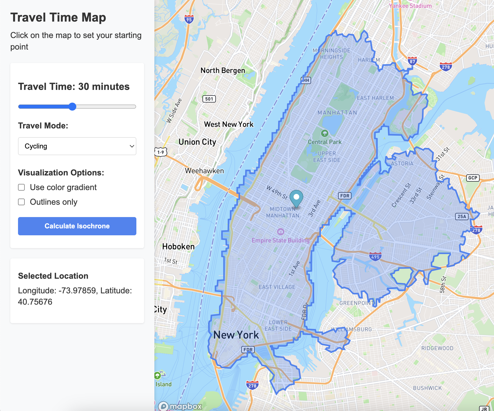
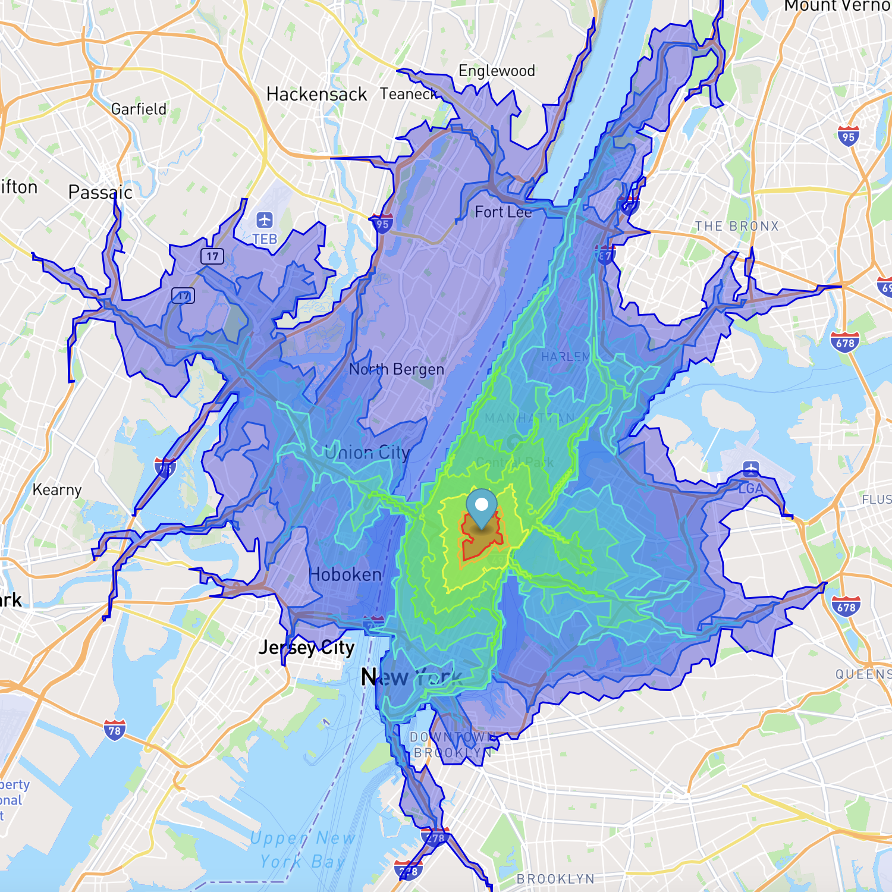
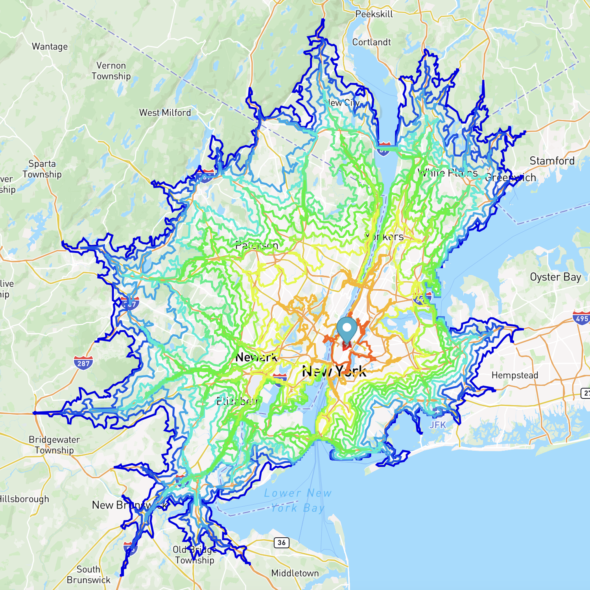

# Travel Time Isochrone Map

This web application allows users to visualize travel times from a selected location to surrounding areas using isochrones (contour lines of equal travel time).

## Features

- Interactive map where users can select a starting location
- Adjustable travel time slider to visualize different time ranges
- Multiple travel modes (driving, walking, cycling)
- Real-time isochrone visualization showing reachable areas within the selected time

## Examples







## How It Works

1. Click anywhere on the map to set your starting point
2. Use the slider to select your maximum travel time (5-60 minutes)
3. Choose your preferred travel mode
4. Click "Calculate Isochrone"
5. The map will display a colored area showing all locations reachable within your selected time

## Setup Instructions

### Prerequisites

- A Mapbox account and API access token (free tier available)
- A modern web browser
- Node.js and npm installed on your machine

### Installation

- Clone or download this repository
- Install dependencies:
  ```bash
  npm install
  ```
- Create a `.env` file in the project root (ignored by Git) with:
  ```bash
  MAPBOX_TOKEN="your_mapbox_token_here"
  ```

### Getting a Mapbox Token

1. Sign up for a free account at [mapbox.com](https://www.mapbox.com/)
2. Navigate to your account page
3. Copy your default public token or create a new one

## Local Development

After installing dependencies and creating your `.env` file, you can run the application locally:

```bash
npm start
``` 

This will serve the application on a local development server (typically at http://localhost:3000).

Alternatively, you can use any static file server of your choice to serve the application files.

## Deployment Options

You can deploy this application on any hosting platform that supports static websites:

1. Build the application (if needed):
  ```bash
  npm run build
  ```

2. Upload the resulting files to your preferred hosting service:
  - GitHub Pages
  - Netlify
  - Vercel
  - AWS S3
  - Any traditional web hosting

When deploying, make sure to set up your MAPBOX_TOKEN as an environment variable on your hosting platform or update the token retrieval method to suit your deployment environment.

## Technology Stack

- HTML5, CSS3, and JavaScript
- [Mapbox GL JS](https://docs.mapbox.com/mapbox-gl-js/api/) for the map interface
- [Mapbox Isochrone API](https://docs.mapbox.com/api/navigation/isochrone/) for travel time calculations

## License

This project is available under the MIT License.